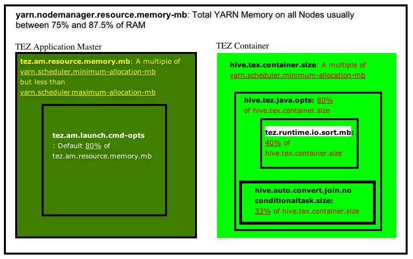

<h3>Unofficial Guide for Tuning HDP Services</h3>

<br>&ensp;&ensp;<b>Tuning Tips and Tricks</b>
<br>
<br><b>Hive Ports: (<a href="http://docs.hortonworks.com/HDPDocuments/HDP2/HDP-2.5.3/bk_reference/content/hive-ports.html">Reference</a>)</b>
<br>&ensp;&ensp;&bull; Hive Server: 10000
<br>&ensp;&ensp;&bull; Hive Web UI: 9999
<br>&ensp;&ensp;&bull; Hive Metastore: 9083
<br>
<br><b>General Recommendations:</b>
<br>&ensp;&ensp;&bull; Enable Tez
<br>&ensp;&ensp;&bull; Store as ORC and use Zlib/Snappy compression
<br>&ensp;&ensp;&bull; Use Vectorization
<br>&ensp;&ensp;&bull; Use CBO (Cost-Based Optimizer) with Column Stats (CBO requires stats)
<br>&ensp;&ensp;&bull; Check SQL syntax
<br>&ensp;&ensp;&bull; Use Tez View (within Ambari) for troublshooting 
<br>&ensp;&ensp;&bull; Look at number of reduces & mappers (how many are running in parallel, what are the runtimes)
<br>&ensp;&ensp;&bull; Check the HDFS Hive file sizes (~1GB each) 
<br>&ensp;&ensp;&bull; vCores (80 - 90%)
<br>&ensp;&ensp;&bull; Partition (evenly) on moderate cardinality variable (500, 1000 partitions? 10000?, 20000?)
<br>&ensp;&ensp;&bull; Bucketing provides "sub-partitions" of a partition (or further sampling/decomposition of datasets
<br>
<br>CREATE TABLE mytable ( 
<br>&ensp;&ensp;&ensp;&ensp;name string,
<br>&ensp;&ensp;&ensp;&ensp;city string,
<br>&ensp;&ensp;&ensp;&ensp;employee_id int ) 
<br>PARTITIONED BY (year STRING, month STRING, day STRING) 
<br>CLUSTERED BY (employee_id) INTO 256 BUCKETS;
<br>
<br><b>Configuration Suggestions:</b>
<br>
<br>set hive.cbo.enable=true;
<br>set hive.compute.query.using.stats=true;
<br>set hive.exec.dynamic.partition.mode=nonstrict;
<br>set hive.exec.dynamic.partition=true;
<br>set hive.exec.max.created.files=1000000;
<br>set hive.exec.max.dynamic.partitions.pernode=100000;
<br>set hive.exec.max.dynamic.partitions=100000;
<br>set hive.exec.parallel.thread.number=16;
<br>set hive.exec.parallel=true;
<br>set hive.exec.reducers.bytes.per.reducer=1000000000;   -- 1GB
<br>set hive.exec.reducers.max=2000;
<br>set hive.execution.engine=tez;
<br>set hive.optimize.reducededuplication.min.reducer=1;
<br>set hive.optimize.sort.dynamic.partition=true;
<br>set hive.stats.autogather=true;
<br>set hive.stats.fetch.column.stats=true;
<br>set hive.stats.fetch.partition.stats=true;
<br>set hive.support.sql11.reserved.keywords=false; 
<br>set hive.tez.auto.reducer.parallelism=true;
<br>set hive.tez.container.size = yarn.scheduler.minimum-allocation-mb (1 or 2 times) and less than yarn.scheduler.maximum-allocation-mb
<br>set hive.tez.exec.print.summary=true;
<br>--set hive.tez.java.opts=-XX:+PrintGCDetails -verbose:gc -XX:+PrintGCTimeStamps -XX:+UseNUMA -XX:+UseG1GC -XX:+HeapDumpOnOutOfMemoryError -XX:HeapDumpPath=/tmp/;
<br>set hive.tez.max.partition.factor=2.0;
<br>set hive.tez.min.partition.factor=0.25; 
<br>set hive.vectorized.execution.enabled = true;
<br>set hive.vectorized.execution.reduce.enabled = true;
<br>set hive.vectorized.execution.reduce.groupby.enabled = true;
<br>set mapred.job.reduce.input.buffer.percent=0.0;
<br>--set mapred.map.tasks=6;
<br>set mapred.reduce.tasks=-1;
<br>set mapreduce.input.fileinputformat.split.minsize.per.node=240000000; -- 240 MB
<br>set mapreduce.input.fileinputformat.split.minsize.per.rack=240000000; -- 240 MB
<br>set mapreduce.input.fileinputformat.split.minsizee=240000000;         -- 240 MB
<br>set tez.container.max.java.heap.fraction=0.8
<br>set tez.grouping.max-size=1073741824; -- 1GB
<br>set tez.grouping.min-size=16777216;   -- 16 MB
<br>set tez.queue.name=hive;
<br>set tez.runtime.empty.partitions.info-via-events.enabled=true;
<br>set tez.runtime.report.partition.stats=true;
<br>set yarn.nodemanager.resource.memory-mb = Usually between 75% - 87.5% RAM
<br>set yarn.scheduler.maximum-allocation-mb = yarn.nodemanager.resource.memory-mb
<br>set yarn.scheduler.minimum-allocation-mb = Memory per processor (or less)
<br>
<br>Setup ORC:
<br>```CREATE TABLE A_ORC (ID int, name string, value float) STORED AS ORC tblproperties (“orc.compress" = “SNAPPY”);```
<br>
<br>```INSERT INTO TABLE A_ORC SELECT * FROM A;```
<br>
<br>Create table and column stats:
<br>```ANALYZE TABLE myORCtable partition (col1, col2, col3) COMPUTE STATISTICS;```
<br>```ANALYZE TABLE myORCtable partition (col1, col2, col3) COMPUTE STATISTICS for columns;```
<br>
<br>
<br>
<br><b>Hive References:</b>
<br><a href="http://docs.hortonworks.com/HDPDocuments/HDP2/HDP-2.5.3/bk_hive-performance-tuning/content/ch_hive_architectural_overview.html">Hortonworks - Apache Hive Tuning for High Performance</a>
<br><a href="https://community.hortonworks.com/content/kbentry/14309/demystify-tez-tuning-step-by-step.html">Apache Hive on Tez - Tuning Best Practices (Part 1)</a>
<br><a href="https://community.hortonworks.com/articles/22419/hive-on-tez-performance-tuning-determining-reducer.html">Apache Hive on Tez - Tuning Best Practices (Part 2)</a>
<br><a href="http://docs.hortonworks.com/HDPDocuments/HDP2/HDP-2.5.3/bk_hive-performance-tuning/content/section_create_configure_yarn_capacity_scheduler_queues.html">Capacity Scheduler Queues - Allocate cluster resources among users and groups</a>
<br><a href="http://hortonworks.com/blog/5-ways-make-hive-queries-run-faster/">5 Ways to Improve Hive Performance</a>
<br>
<br>
<br>
<br>
<br>Tuning Tips and Tricks</h3>
<br>
<br><b>1. Caching:</b> 
<br>&ensp;&ensp;&bull; MEMORY_ONLY: (default/recommended) Store RDD as deserialized objects in JVM Heap
<br>&ensp;&ensp;&bull; MEMORY_ONLY_SER: (2nd option) Store RDD as serialized Kryo objects. Trade CPU time for memory savings
<br>&ensp;&ensp;&bull; MEMORY_AND_DISK: Spill to disk if can’t fit in memory
<br>&ensp;&ensp;&bull; MEMORY_AND_DISK_SER: Spill serialized RDD to disk if it can’t fit in memory
<br>
<br><b>2. Data Serialization Performance:</b> 
<br>&ensp;&ensp;&bull; Reduces data size, so less data transfer
<br>&ensp;&ensp;&bull; Use Kyro over Java (Kyro is up to 10x faster)
<br>&ensp;&ensp;&bull; conf.set(“spark.serializer”, “org.apache.spark.serializer.KryoSerializer”)
<br>
<br><b>3. Memory and Garbage Collection Tuning:</b>
<br>&ensp;&ensp;&bull; GC is a problem for Spark apps which churn RDDs
<br>&ensp;&ensp;&bull; Measure time spent in GC by logging: -verbose:gc –XX:+PrintGCDetails –XX:+PrintGCTimeStamps
<br>&ensp;&ensp;&bull; If there’s excessive GC per task, use the MEMORY_ONLY_SER storage
level to limit just one object per RDD 
<br>&ensp;&ensp;&ensp;&ensp;partition (one byte array) and reduce the spark.storage.memoryFraction value from 0.6 to 0.5 or less.
<br>
<br><b>4. Set Correct Level of Parallelism:</b> 
<br>&ensp;&ensp;&bull; set spark.default.parallelism = 2-3 tasks per CPU core in your cluster
<br>&ensp;&ensp;&bull; Normally 3 - 6 executors per node is a reasonable, depends on the CPU cores and memory size per executor
<br>&ensp;&ensp;&bull; 5 or less cores per executor (per node)  (ie. 24-core node could run 24/4cores = 6 executors)
<br>&ensp;&ensp;&bull; set num-executors = (4 nodes * 6 executors = 24 executors - 1 = 23 total executors)
<br>&ensp;&ensp;&bull; set executor-memory = 256GB-2GB RAM / 6 executors = 42GB - 2GB = 40GB
<br>
<br><b>Configuration Suggestions:</b>
<br>
<br><b>Spark References:</b>
<br><a href="https://spark.apache.org/docs/latest/tuning.html">Apache Spark (latest) General Tuning</a>
<br><a href="http://spark.apache.org/docs/latest/configuration.html#Dynamically-Loading-Spark-Properties">Apache Spark (latest) Properties / Configuration Settings</a>
<br><a href="http://docs.hortonworks.com/HDPDocuments/HDP2/HDP-2.5.3/bk_spark-component-guide/content/ch_tuning-spark.html">Hortonworks - Apache Spark Tuning Guide</a>
<br><a href="https://databricks.com/blog/2015/05/28/tuning-java-garbage-collection-for-spark-applications.html">Tuning Java Garbage Collection</a>
<br><a href="http://www.slideshare.net/jcmia1/apache-spark-20-tuning-guide">Apache Spark 2.0 Tuning Guide</a>
<br><a href="http://stackoverflow.com/questions/37871194/how-to-tune-spark-executor-number-cores-and-executor-memory">How to tune Spark executor number cores and executor memory</a>
<br><a href="http://c2fo.io/c2fo/spark/aws/emr/2016/07/06/apache-spark-config-cheatsheet/">Apache Spark Config</a>
<br>
<br>
<br>
<br>
<br>&ensp;&ensp;<b>Tuning Tips and Tricks</b>
<br>
<br><b>HBase Ports: (<a href="http://docs.hortonworks.com/HDPDocuments/HDP2/HDP-2.5.3/bk_reference/content/hbase-ports.html">Reference</a>)</b>
<br>&ensp;&ensp;&bull; HMaster: 16000
<br>&ensp;&ensp;&bull; HMaster Info Web UI: 16010
<br>&ensp;&ensp;&bull; Region Server (slave nodes): 16020/16320
<br>&ensp;&ensp;&bull; HBase Thrift Server: 9090/9095
<br>
<br><b>General Recommendations:</b>
<br>&ensp;&ensp;&bull; zookeeper.session.timeout = 1 minute (default: 3 minutes)
<br>&ensp;&ensp;&bull; dfs.datanode.failed.volumes.tolerated = half the amount of your available disks
<br>&ensp;&ensp;&bull; HBase currently does not do well with anything above two or three <a href="https://hbase.apache.org/book.html#number.of.cfs">column families</a>
<br>&ensp;&ensp;&bull; Reduce Hotspotting:
<br>&ensp;&ensp;&ensp;&ensp;&ensp;&ensp;&bull; Salting (add random prefix to the rowkey, causes different sorting)
<br>&ensp;&ensp;&ensp;&ensp;&ensp;&ensp;&bull; Hashing 
<br>&ensp;&ensp;&ensp;&ensp;&ensp;&ensp;&bull; Reversing the Key (reverse a fixed-width or numeric row key)
<br>&ensp;&ensp;&bull; hbase.regionserver.handler.count = cores (for concurrency, threads kept open to answer incoming requests)
<br>&ensp;&ensp;&bull; hbase.master.balancer.maxRitPercent = 0.25 (25% regions in transition when balancing, and cluster’s availability is at least 75% when balancing)
<br>&ensp;&ensp;&bull; hbase.balancer.period = 30000 (Period, in ms, at which the region balancer runs in the Master)
<br>
<br><b>Spark References:</b>
<br><a href="https://hbase.apache.org/book.html">HBase Reference Guide</a>
<br>
